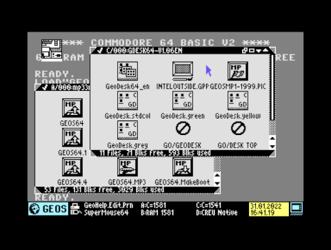
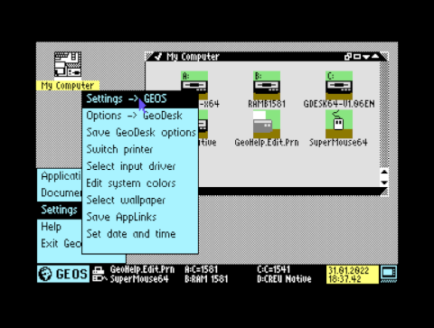
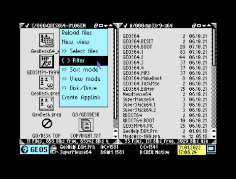
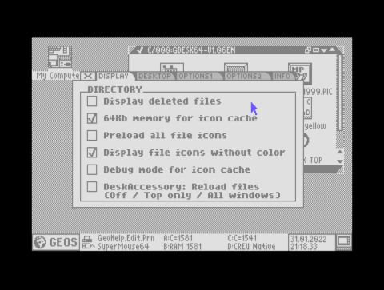

# Area6510

### GEODESK64
GeoDesk is a new DeskTop for GEOS/MegaPatch64, GEOS/MegaPatch128 is not supported.

GeoDesk requires at least 256Kb of RAM/GEOS-DACC and supports drag'n'drop, multiple windows and supports all CMD hardware and SD2IEC devices.
Note: All colors can be turned off if you prefere using the old "grey" color style from GEOS 2.x!

# WARNING!
THIS SOFTWARE IS PROVIDED BY THE AUTHOR 'AS IS' AND ANY EXPRESS OR IMPLIED
WARRANTIES, INCLUDING, BUT NOT LIMITED TO, THE IMPLIED WARRANTIES OF
MERCHANTABILITY AND FITNESS FOR A PARTICULAR PURPOSE ARE DISCLAIMED. IN NO
EVENT SHALL THE AUTHOR BE LIABLE FOR ANY DIRECT, INDIRECT, INCIDENTAL,
SPECIAL, EXEMPLARY, OR CONSEQUENTIAL DAMAGES (INCLUDING, BUT NOT LIMITED TO,
PROCUREMENT OF SUBSTITUTE GOODS OR SERVICES; LOSS OF USE, DATA, OR PROFITS;
OR BUSINESS INTERRUPTION) HOWEVER CAUSED AND ON ANY THEORY OF LIABILITY,
WHETHER IN CONTRACT, STRICT LIABILITY, OR TORT (INCLUDING NEGLIGENCE OR
OTHERWISE) ARISING IN ANY WAY OUT OF THE USE OF THIS SOFTWARE, EVEN IF
ADVISED OF THE POSSIBILITY OF SUCH DAMAGE.
