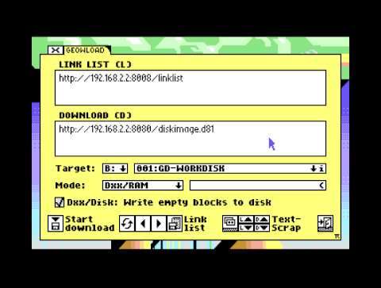
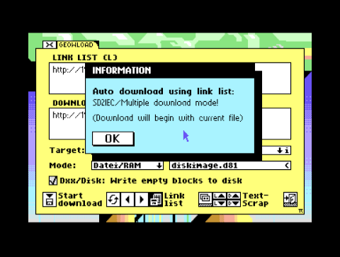

# Area6510

### geoWLoad64
The goal of this project is to download files with the WiC64 over the internet directly to the Commodore64 running GEOS/MegaPatch64 or GDOS64.

Note: The ESP32 used for the WiC64 currently only supports http connections. Currently https connections are not supported.

You can enter a download url, select a target drive and start the download. You can also specify an url for a link list containing multiple download urls.

Add the url for the link list and select the "recycle" icon to load the current link list. The first entry will automatically be copied to the download url. Select < and > to browse through the link list.

The target drive can be any GEOS drive from A: to D:. On CMD-drives you can select another partition using the down arrow right to the disk name.
Select the 'i' info icon to get information about free disk space.

The download mode can be one of the following modes:

* Dxx/RAM:
Download DiskImage to a RAM-Disk.
* Dxx/Disk:
Download DiskImage to a disk drive.
* Dxx/SD2IEC:
Download DiskImage to a SD2IEC directory.
* File/RAM:
Download files to a RAM-Disk.
* File/Disk:
Download files to a disk drive.
* File/SD2IEC:
Download files to a SD2IEC directory.

Depending on the selected target drive not all modes will be available or possible.

You can open the TextManager and copy/paste URLs to a text album. You can copy/paste URLs from/to the link list (L) or from/to the download url (D).

With v0.1 there is another option for downloading multiple files. The auto download option will work with Dxx/SD2IEC, File/SD2IEC, File/RAM or File/Disk.
If you download to an SD2IEC directory and the download will include some matching disk images you will get asked if a swap list file should be created.

When downloading a single file named "swaplist.lst" to an SD2IEC directory you will get asked if you want to enable the swap list.

You can add a default URL for either the link list or download url. Add the following at the beginning of the info text of geoWLoad64:

* Default link list:
L:http//link-list-url...
* Default download url:
D:http://download-url...

Make sure to add a new line at the end of the URL.

