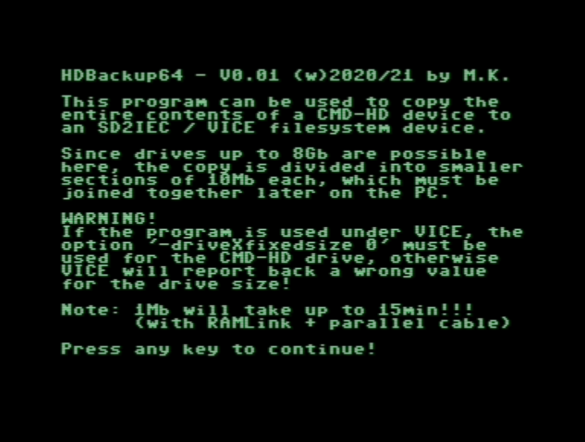
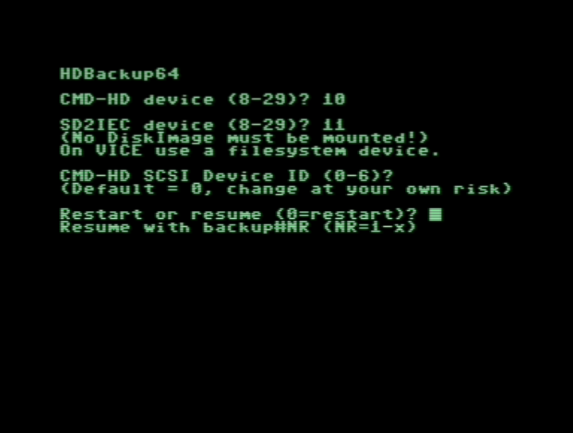
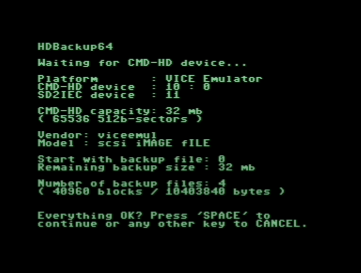
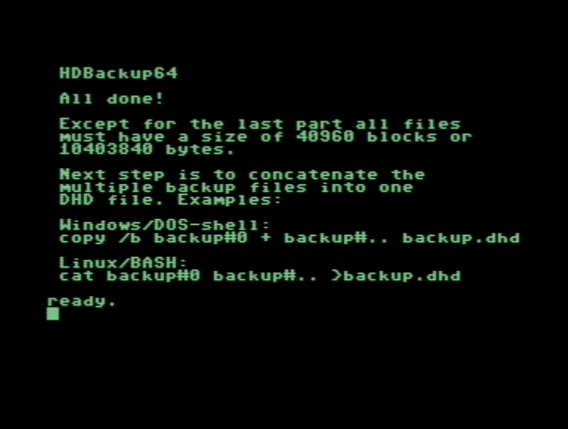
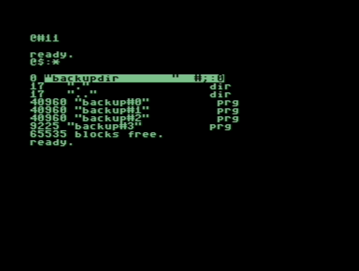

# Area6510

### HDBackup64
With this program you can copy the contents of an entire CMD-HD/SCSI disk drive to an SD2IEC device on your C64! No SCSI-Card on your PC is required.

If you merge the multiple backup files into one backup.dhd file, then you can mount this diskimage using VICE >= 3.5.

Backup a 80Mb SCSI disk drive will take up to 16h with a SuperCPU64 and a RAMLink/PP-cable. Without such hardware it just will take longer but the only real requirement is a SD2IEC device. Backup on other drives (except VICE file system drive) is not possible.

Here are a few screenshots:

