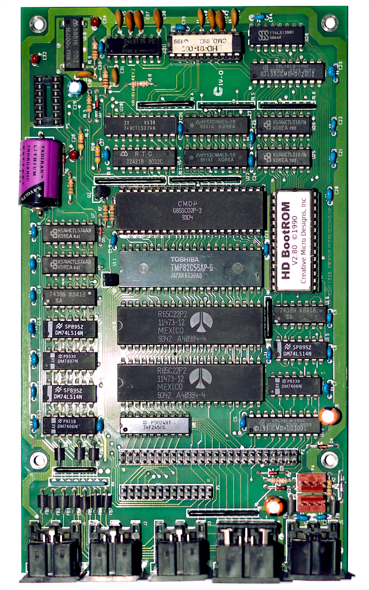
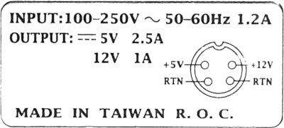

# Area6510

## CMD HD

#### CMD Hard Drive - "BOOT ROM" History

* HD Boot ROM V2.44:
Earliest known version. Limited to 500MB Hard Drives/Storage devices.
* HD Boot ROM V2.54:
No information on changes but has been seen in the wild.
* HD Boot ROM V2.58:
Minor changes.
* HD Boot ROM V2.62:
Support added for up to 4.04 GB Hard Drives/Storage devices.
* HD Boot ROM V2.68:
DOS bug fix
* HD Boot ROM V2.78:
Partition Directory Fix.
* HD Boot ROM V2.80:
Latest & Final Version.


#### CMD Hard Drive - DOS History

* DOS 1.86:
First ever Version of DOS
* DOS 1.92:
Latest & Final Version of DOS


#### CMD Hard Drive - Known Bugs

* DOS 1.86 & DOS 1.92

The DOS does not have the ability to prevent the user from using the CD command (Change Directory), on a FILE.PRG.

This can be catastrophic if you are copying files to a Directory, and you use the Wild card "*" to identify the DESTINATION Directory, (using the old version of CMD HD TOOLS. only ! )

This can also occur in immediate mode, if you type \@CD:FILE (If the FILE is a PRG file type and not a DIR). This scrambles the pointers and the only way to recover from this is to use the command:

```
@CD /
```


#### CMD Hard Drive - A look Inside


Image (c)2021 by Markus Kanet, all rights reserved.

Battery is a Tadiran SL-750/S High Energy Lithium Battery (1/2 AA), power supply uses 5V/2.5A and 12V/1A.



## CMD Hard Drive - Replica review

[CMD-HD Replica by toms01 review by mkanet rev.01](https://bitbucket.org/mkgit64/area6510/src/master/doc/cmdhd/cmd-hd-replica-review-01.pdf) [[ODT]](https://bitbucket.org/mkgit64/area6510/src/master/doc/cmdhd/cmd-hd-replica-review-01.odt)

[CMD-HD Replica by toms01 review by mkanet rev.02](https://bitbucket.org/mkgit64/area6510/src/master/doc/cmdhd/cmd-hd-replica-review-02.pdf) [[ODT]](https://bitbucket.org/mkgit64/area6510/src/master/doc/cmdhd/cmd-hd-replica-review-02.odt)

[CMD-HD Replica by toms01 review by mkanet rev.02 english](https://bitbucket.org/mkgit64/area6510/src/master/doc/cmdhd/cmd-hd-replica-review-02en.pdf) [[ODT]](https://bitbucket.org/mkgit64/area6510/src/master/doc/cmdhd/cmd-hd-replica-review-02en.odt)
