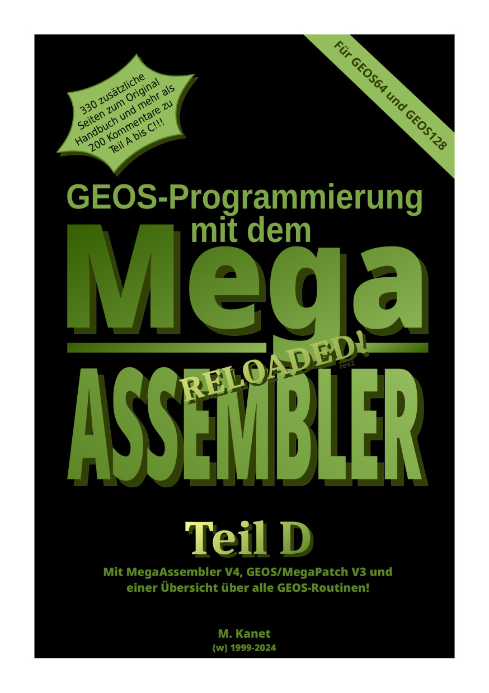

# Area6510

## GEOS-MegaAssembler manual
Part D from the unofficial, completely revised german manual "GEOS-Programmierung mit dem MegaAssembler".
This part includes the manual for MegaAssembler V4 and the technical manual for GEOS/MegaPatch.

Also included are some source code examples. Some of these are applications that can be downloaded from /usr/releases, source code is avilable from /usr/sources and documnetation can be found in /src/megaassembler-demos.

Note: "Part D" is only a small part of the complete manual so page numbers in the pdf may not match the real page numbers.

