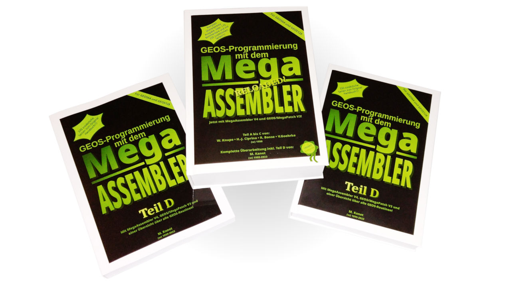

# Area6510

## GEOS-MegaAssembler manual "Part D"
Templates for ordering a printed version of this book, only "Part D" is available.

There are covers for softcover print (glossy cover recommended) and hardcover print. There are also covers including the non-printable border to bind the book.

## WARNING!
### The manual still contains some errors and typos, further updates of the PDF are possible!

#
#
#

