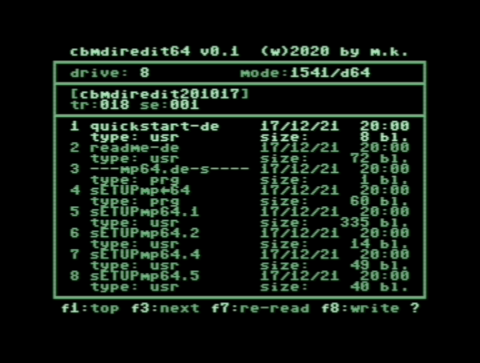

# Area6510

### cbmDirEdit64
The goal of this project is to enable users to edit the date and time of files on floppy disks or disk images. Supported are 1541, 1571, 1581 and NativeMode. It is also possible to edit file name, file type and file size.

Date and time files are supported by both GEOS and JiffyDOS (only on CMD devices with RTC).

Most file copy utilities cannot copy date and time between drives. So far, GEOS seems to offer the most complete support for copying files with original date and time.
If you do not want to use GEOS, you can use this utility to edit the date and time on the target disk to match the original files.

cbmDirEdit64 was written entirely in BASIC V2. The C128 is not officially supported, but should work with a few exceptions.

Since no assembler code is used here, the program is very slow. A SuperCPU or a TurboChameleon64 is recommended.

The program was tested with VICE and a C64 Reloaded MK2. The following drives were tested: SD2IEC, RAMLink, CMD-HD, D64, D71, D81, DNP. On CMD drives different partition formats were tested.

