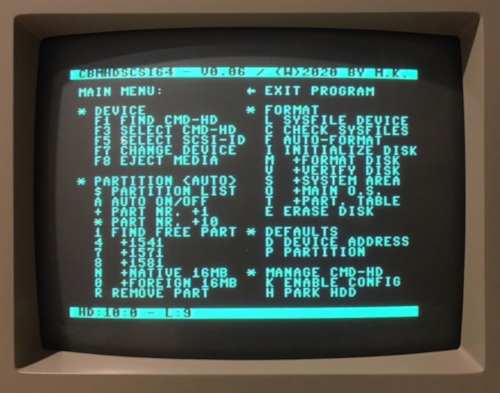
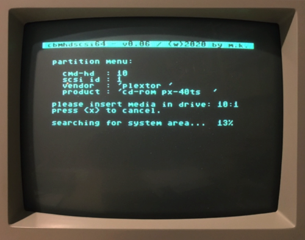

# Area6510

### cbmHDscsi64
The goal of this project is to format and initialize a SCSI device connected to a CMD-HD easily and without additional programs.

So far you need llformat, createsys, rewrite dos, system header, hddos and geoshd. Additionally you have to set the CMD-HD into configuration mode by pressing several buttons.

Pressing the buttons on the CMD-HD is no longer absolutely necessary: Using various HD-ROM routines, this can also be done by software.

### Requirements
You need three extra files from the CMD-HD utility disk:

* system header
* hdos v1.92
* geos/hd v2.00

These files do include the main operating system for the CMD-HD and are required if you want to format a disk.

The CMD-HD must have a HD-ROM V2.80. Older HD-ROMs are not supported.

