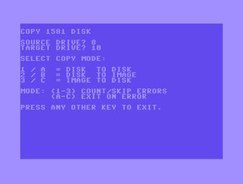

# Area6510

### copydisk
The goal of this project is to be able to copy disk or disk images between drives and SD2IEC/VICE/CMDNative directories.
C=1541, C=1571, C=1581 and CMD Native supported.

Note: If you are using a C64 with a 1571 disk drive you must use COPY1571 for double sided disks and COPY1541 for single sided disks!

#### NOTE:
JiffyDOS is recommended to speed up the copy process and to set directories and or partitions on source and target drive using "@"-commands.

#### HINTS:
You need at least two drives, source and target can not be on the same device.
If you want to backup many different original disks to SD2IEC you can copy the system files (COPY15x1 and RDWRSEKLIB) to the SD2IEC target directory and load the required copy tool from there.

The copy tools will ignore errors during backup when using the copy modes '1-3': You will get a warning about errors after the job has been completed.
If you want to stop on errors you can use the copy modes 'A-C': The program will stop on first error detected.

Copy modes '1/2' can be used to copy as much sectors from damaged disks as possible.

#### ERRORS:
If an error occurs the status byte will help you to identify the problem. All disk errors will be reported but some values do have some special meaning:

- STATUS: 66  -> Could happen when writing a D71/D81 file to a 1541 disk drive. 66 means "Illegal block or sector".
- STATUS: 64  -> Could happen when writing a D64 file to a 1571 disk drive using COPY1571. 64 mean "No more data in disk image".
- STATUS: 26  -> Target disk is WRITE PROTECTED.

For other status codes please refer to the disk drive manual.

You will also see the drive and track where the error occurred.

