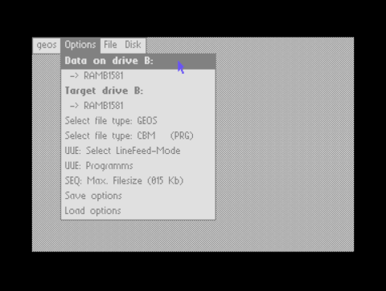
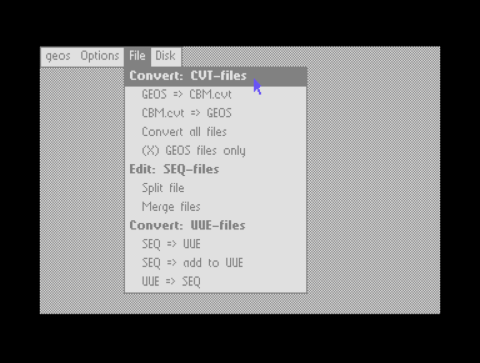
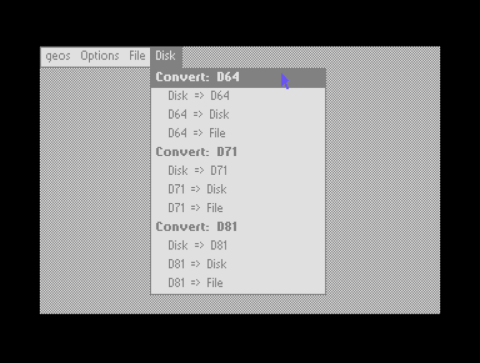

# Area6510

### geoConvert 4.x
This is an improved version of the deprecated 'geoConvert 98f'. This utility can convert files from GEOS to CBM, CBM to GEOS, SEQ to UUE and UUE to SEQ. UUE was a helpful file format in the beginnings of the internet to send files using eMail. UUE is mostly deprected but is still included since it may still work.
geoConvert can handle D64 disk images: Create and write images and also extract single files from disk images. Since version 4.x geoConvert can also handle D71/D81 disk images.
Unlike Convert 2.x/3.x this utility can handle GEOS VLIR-files with a chain-length of more then 255 blocks using a special .G98 file format. You need geoConvert to convert this files back to GEOS. See 'info.geoConvert.txt' and 'src.ConvCVT.s' for more details about this.

